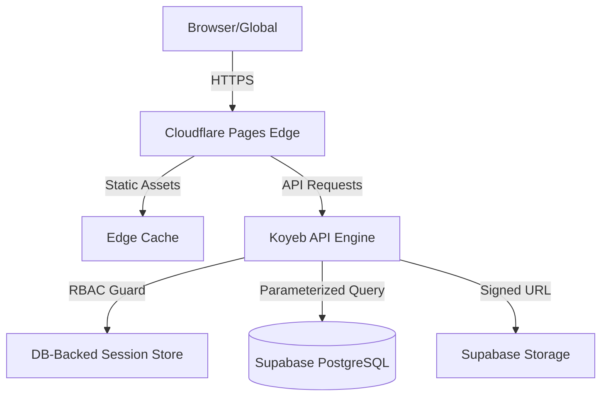

# 🛠️ MoveX Production Operations Guide

> **Ecosystem Status:** Production-Ready  
> **Last Verified:** January 2026  
> **Infrastructure:** Cloudflare (Edge) + Koyeb (Compute) + Supabase (State)

This manual is the definitive guide for maintaining the MoveX production environment. It details the infrastructure stack, security hardening requirements, deployment pipelines, and incident response procedures.

---

## 📑 Governance & Standards

### The "Production-Ready" Benchmark
A MoveX release is only considered production-ready when it satisfies the following quadruple-constraint:

1.  **Immutability:** Runtime code is immutable; all configuration is injected via Environment Variables.
2.  **Statelessness:** The API server retains no local state; all session and shipment data persists in PostgreSQL.
3.  **Security:** 100% adherence to the Content Security Policy (CSP) and HSTS requirements.
4.  **Observability:** Health check endpoints (`/api/health`) are active and monitored.

---

## 🏗️ Architecture Visualization



### Infrastructure Components

| Layer | Provider | Responsibility |
| :--- | :--- | :--- |
| **Edge & CDN** | Cloudflare Pages | SSL Termination, WAF, Static Asset Delivery |
| **Application** | Koyeb | Node.js Runtime, Auth logic, Shipment Orchestration |
| **Database** | Supabase | Relational data persistence, Session storage |
| **Object Storage** | Supabase Storage | Encrypted storage for shipment proof/photos |

---

## 🛢️ Supabase & Database Hardening

### Step-by-Step Production Provisioning

#### 1. Project Initialization
- Create a project in the **Closest Data Center** to your operations (e.g., `ap-south-1` for India).
- Enable **Database Webhooks** if you plan to integrate third-party notifications.

#### 2. Schema Deployment
Execute the logical schema in the **Supabase SQL Editor**. Ensure you run the migrations in sequential order as defined in `backend/sql/`.

#### 3. Row Level Security (RLS)
MoveX relies on database-level security. Every table must have RLS enabled.
```sql
ALTER TABLE shipments ENABLE ROW LEVEL SECURITY;
-- Policies are defined in backend/sql/012_enable_rls_shipments.sql
```

### The Connection String Strategy
Always use the **Session Pooler (Port 6543)** for the application to handle high-concurrency spikes. Use the **Direct Connection (Port 5432)** only for administrative maintenance or heavy migrations.

---

## 📂 Production Environment Variables

Security policy requires secrets to be rotated every 90 days.

| Variable | Requirement | Description |
| :--- | :--- | :--- |
| `NODE_ENV` | `production` | Switches Express to high-performance mode |
| `DATABASE_URL` | `postgresql://...` | Connection string (MUST include `?sslmode=require`) |
| `JWT_SECRET` | 64+ char hex | Signs cross-origin auth tokens |
| `SESSION_SECRET` | 64+ char hex | Signs session cookies |
| `SESSION_SAME_SITE` | `None` | Necessary for Cloudflare Pages <-> Koyeb communication |
| `FRONTEND_URL` | Verified URL | Enforces CORS whitelist |
| `MAINTENANCE_MODE` | `true/false` | Global traffic kill-switch |

---

## 🚢 Deployment Workflow

### 1. Frontend: Cloudflare Pages
MoveX is optimized for the **Wrangler** ecosystem.
- **Root Directory:** `./`
- **Framework Preset:** None (Static)
- **Node.js Version:** 18+

### 2. Backend: Koyeb Express Engine
- **Runtime:** Node.js (Standard Buildpack)
- **Port:** 8000 (Forwarded to 443 via Koyeb ingress)
- **Health Check Path:** `/api/health`

### 3. Verification Checklist
After every deploy, run these smoke tests:
1.  Check `/api/maintenance` returns the current mode.
2.  Attempt login with an invalid user (verify 401 response).
3.  Check browser console for **CSP Violations**.

---

## 🛠️ Operational Workflows

### Maintenance Mode Protocol
When performing database migrations or major UI overhauls:
1.  Set `MAINTENANCE_MODE=true` in Koyeb environment.
2.  Trigger a "Redeploy" or "Resume" service.
3.  Users will be automatically redirected to the `/maintenance` subfolder.
4.  Standard APIs (except `/api/health` and Admin-gated routes) will return a 503 status.

### Remote Session Termination
If an admin account is suspected of compromise:
1.  Access the **Users Management** dashboard.
2.  Locate the user and click **Disable Account**.
3.  The backend triggers `sessionStore.destroySessionsForUser(id)`, instantly logging out the user from all devices globally.

---

## 🆘 Appendix: Troubleshooting

### "The request was blocked by CORS"
- **Cause:** `FRONTEND_URL` in backend env does not match the actual browser URL.
- **Fix:** Verify protocol (https vs http) and trailing slashes.

### "Cookie not saved" (Authentication Fails)
- **Cause:** Running on `https` but `SESSION_SECURE` is set to `false`, OR `SESSION_SAME_SITE` is not `None`.
- **Fix:** In production, cookies MUST be `Secure; SameSite=None`.

### "Database Connection Timeout"
- **Cause:** Maxing out direct connections on port 5432.
- **Fix:** Switch `DATABASE_URL` to the pooled connection on port 6543.

---

<div align="center">
  <sub>MoveX Operational Integrity System - Version 2.1.0</sub>
</div>
This ensures authentication works even when browsers block third-party cookies.

```javascript
// Frontend stores token after login
sessionStorage.setItem('movexsecuresession', JSON.stringify({
    data: { token, role, username, loginTime }
}));

// Frontend sends token in all API calls
headers['Authorization'] = `Bearer ${token}`;

// Backend validates both cookie AND JWT
async function validateSession(req, res, next) {
    // Try cookie first
    const sid = req.cookies?.['movex.sid'];
    if (sid && await validateCookieSession(sid)) return next();
    
    // Fallback to JWT
    const token = req.headers.authorization?.substring(7);
    if (token && jwt.verify(token, JWT_SECRET)) return next();
    
    return res.status(401).json({ error: 'Not authenticated' });
}
```

### Option 2: Railway (Alternative)

1. Connect GitHub repository
2. Set environment variables in Railway dashboard
3. Railway auto-detects Node.js and deploys

### Option 3: VPS (DigitalOcean, AWS EC2, etc.)

1. Install Node.js 18+
2. Clone repository
3. Set up `.env`
4. Use PM2 for process management:
   ```bash
   npm install -g pm2
   cd backend
   pm2 start src/app.js --name movex
   pm2 save
   ```
5. Set up Nginx reverse proxy
6. Configure SSL with Let's Encrypt

### Pre-Deployment Checklist

- [ ] All environment variables configured
- [ ] `NODE_ENV=production` set
- [ ] Database migrations run on Supabase
- [ ] Admin user created
- [ ] `FRONTEND_URL` set to Cloudflare Pages URL
- [ ] `SESSION_SAME_SITE=none` for cross-origin
- [ ] SSL/HTTPS configured on both frontend and backend
- [ ] Rate limits reviewed
- [ ] API_BASE updated in frontend JS files

### Post-Deployment Verification

1. ✅ Check Cloudflare Pages site loads
2. ✅ Check login works and redirects to dashboard
3. ✅ Check session persists on page refresh
4. ✅ Check shipments load in admin dashboard
5. ✅ Check creating new shipment works
6. ✅ Check logout clears session
7. ✅ Monitor Koyeb logs for errors

---

## Section 9: Common Mistakes to Avoid

### ❌ Security Mistakes

| Mistake | Why It's Bad | Prevention |
|---------|--------------|------------|
| Hardcoding secrets | Secrets in git history forever | Always use env vars |
| Using SERVICE_KEY in frontend | Full database access exposed | Only use ANON_KEY in frontend |
| Short JWT_SECRET | Brute-forceable | Use 64+ character random string |
| Disabling HTTPS in production | All data visible in transit | Always use SSL |
| Logging passwords/tokens | Leaked in logs | Never log sensitive data |

### ❌ Database Mistakes

| Mistake | Why It's Bad | Prevention |
|---------|--------------|------------|
| String concatenation in queries | SQL injection | Use parameterized queries |
| No connection pooling | Connection exhaustion | Use pooled connection (port 6543) |
| No indexes | Slow queries | Add indexes on query columns |
| Storing passwords as plain text | Database breach = all passwords | Always use bcrypt |

### ❌ Deployment Mistakes

| Mistake | Why It's Bad | Prevention |
|---------|--------------|------------|
| Using development mode | Debug info exposed, no optimizations | Set NODE_ENV=production |
| No process manager | App dies on crash | Use PM2 or similar |
| No backup strategy | Data loss risk | Enable Supabase backups |
| Ignoring rate limits | DDoS vulnerability | Keep rate limiting enabled |

### ❌ Code Mistakes

| Mistake | Why It's Bad | Prevention |
|---------|--------------|------------|
| Changing response formats | Frontend breaks | Add new fields, don't change existing |
| Renaming routes | All API calls fail | Never rename, only add new |
| Removing middleware | Security bypassed | Only add, never remove |
| Trusting client input | All validation bypassable | Always validate server-side |

---

## Section 10: How to Safely Make Future Changes

### The Golden Rules

1. **Never break what works** - All changes must be backward compatible
2. **Test locally first** - Always verify before deploying
3. **One change at a time** - Small, incremental updates
4. **Keep backups** - Database and code

### Safe Change Process

```
1. UNDERSTAND
   └── What exactly needs to change?
   └── What depends on this code?
   └── What could break?

2. BRANCH
   └── Create git branch for changes
   └── Never work on main/master directly

3. IMPLEMENT
   └── Make minimal changes
   └── Add, don't replace
   └── Document why

4. TEST
   └── Run locally with production DB copy
   └── Test affected features
   └── Test edge cases

5. REVIEW
   └── Check for security issues
   └── Check for breaking changes
   └── Verify logging doesn't expose data

6. DEPLOY
   └── Deploy to staging first if possible
   └── Monitor logs during deployment
   └── Have rollback ready

7. VERIFY
   └── Test in production
   └── Monitor for errors
   └── Confirm with users
```

### Adding New Features

When adding new features:

1. **New routes**: Add new endpoints, don't modify existing ones
2. **New fields**: Add to responses, don't remove existing fields
3. **New tables**: Create new tables, don't modify critical existing ones
4. **New middleware**: Add to chain, don't replace existing

### Modifying Existing Features

When modifying existing features:

1. **Wrap, don't replace**: Create wrapper functions that call old code
2. **Feature flags**: Use environment variables to toggle new behavior
3. **Gradual rollout**: Test with subset of users first
4. **Deprecation path**: Mark old code as deprecated, don't delete immediately

### Emergency Rollback

If something breaks in production:

1. **Immediately revert** to last known working commit
2. **Check database** for any corrupted data
3. **Review logs** to understand what failed
4. **Fix in development** before re-deploying
5. **Document** what went wrong for future

---

## Appendix A: Useful Commands

```bash
# Generate secure secrets
node -e "console.log(require('crypto').randomBytes(32).toString('hex'))"

# Generate bcrypt password hash
node -e "const b = require('bcrypt'); console.log(b.hashSync('password', 12))"

# Start development server
cd backend && npm start

# Start with PM2 (production)
pm2 start backend/src/app.js --name movex

# View PM2 logs
pm2 logs movex

# Restart PM2
pm2 restart movex
```

## Appendix B: Troubleshooting

### "Connection refused" to database
- Check DATABASE_URL is correct
- Verify Supabase project is active
- Check if using correct port (6543 for pooled)

### "SSL required" error
- Add `?sslmode=require` to DATABASE_URL
- Or set `DB_SSL=true` in .env

### Sessions not persisting
- Sessions are now stored in PostgreSQL `sessions` table
- Check database connection is working
- Verify `SESSION_SECRET` is set
- Check cookies are being set (browser dev tools)
- Session expiry is 1 hour (sliding window)

### CORS errors
- Add your frontend URL to `FRONTEND_URL` in .env
- Verify the origin exactly matches (including protocol)

---

## Appendix C: Changelog

### v1.2.0 (January 3, 2026)

#### New Features
- **Cloudflare Pages Deployment**: Static frontend hosting on Cloudflare edge network
  - Added `wrangler.jsonc` for Cloudflare configuration
  - Zero-config static site deployment
  - Global CDN distribution

- **Koyeb Backend Deployment**: Node.js backend hosting on Koyeb
  - Free tier with 24/7 uptime
  - Auto-deploy from GitHub
  - Health check monitoring

- **Cross-Origin Authentication**: Full support for split frontend/backend deployment
  - JWT token fallback when cookies are blocked
  - `Authorization: Bearer` header support
  - Auto-detection of environment (localhost vs production)

#### Technical Changes
- **Frontend API Configuration**:
  - `js/auth-api.js`: Added `API_BASE` auto-detection
  - `js/dashboard-guard.js`: Added `API_BASE` for `/api/me` calls
  - `js/admin-core.js`: Added `API_BASE` for shipments API calls
  - All fetch calls now include `credentials: 'include'`
  - All fetch calls now send `Authorization: Bearer` header

- **Backend Authentication Updates**:
  - `auth.controller.js`: Login now returns JWT token in response
  - `dashboard.js`: `validateSession` accepts both cookies and JWT tokens
  - `profile.js`: `validateSession` accepts both cookies and JWT tokens
  - `sessionMiddleware.js`: Cookie `SameSite` and `Secure` now use environment variables

- **Environment Variables**:
  - Added `SESSION_SAME_SITE` (default: `none` in production)
  - Added `SESSION_SECURE` (default: `true` in production)
  - `PORT=8000` required for Koyeb

#### Files Modified
- `wrangler.jsonc` (new)
- `js/auth-api.js`
- `js/dashboard-guard.js`
- `js/admin-core.js`
- `backend/src/controllers/auth.controller.js`
- `backend/src/sessionMiddleware.js`
- `backend/routes/dashboard.js`
- `backend/routes/profile.js`

---

### v1.1.0 (January 2, 2026)

#### New Features
- **Print Label**: One-click label printing from shipment details
  - Dynamic data population via URL parameters
  - JsBarcode integration for CODE128 barcodes
  - Auto-print on page load
  - Return address uses sender's address from database
  
- **Weight Tracking**: Added weight field to shipments
  - Database column: `weight DECIMAL(10,2)`
  - Displayed in shipment details modal
  - Included in print labels

- **Complete Address Support**:
  - Added `sender_address`, `sender_pincode` fields
  - Added `receiver_address`, `receiver_pincode` fields
  - Full address display in shipment details modal

#### Improvements
- **Shipment Details Modal**: Redesigned with comprehensive information
  - Sender/Receiver cards with full details
  - Route visualization
  - Amount, Weight, Dates in grid layout
  
- **Session Management**: Migrated to PostgreSQL
  - Sessions now persist across server restarts
  - New `sessions` table in database
  - Session expiry reduced to 1 hour

#### Technical Changes
- All session methods now async/await
- Backend routes updated for new fields
- Label design finalized (Delhivery V2 style)

---

**End of Document**

*For questions or issues, refer to the codebase comments or contact the development team.*
